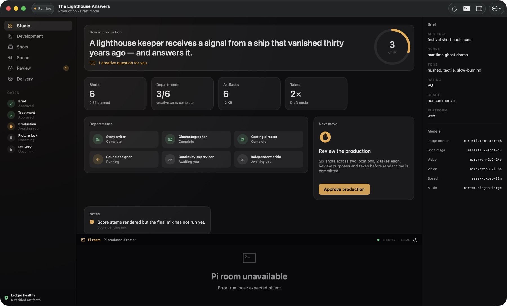
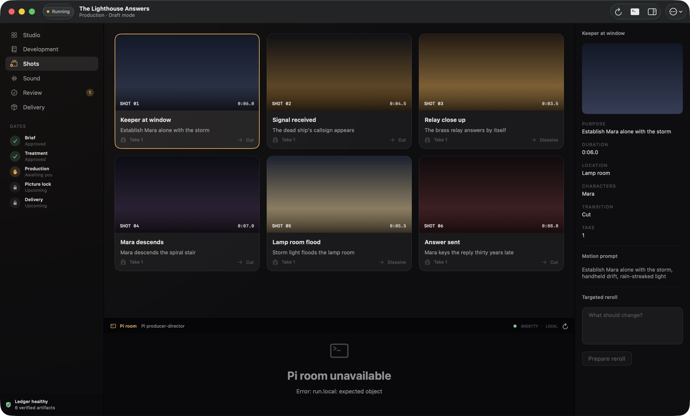
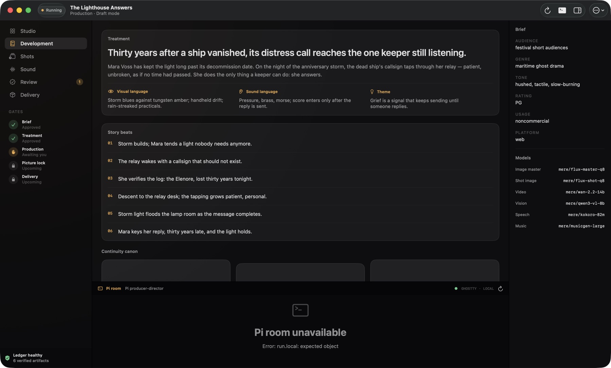
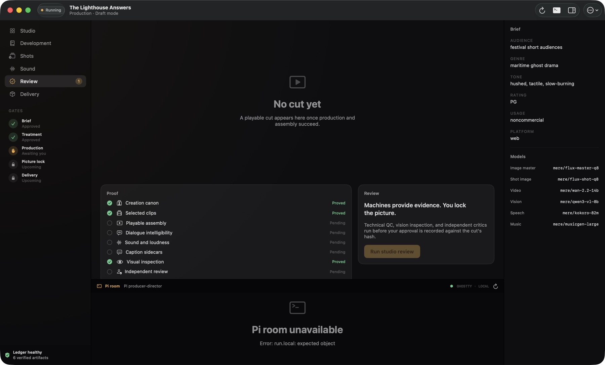
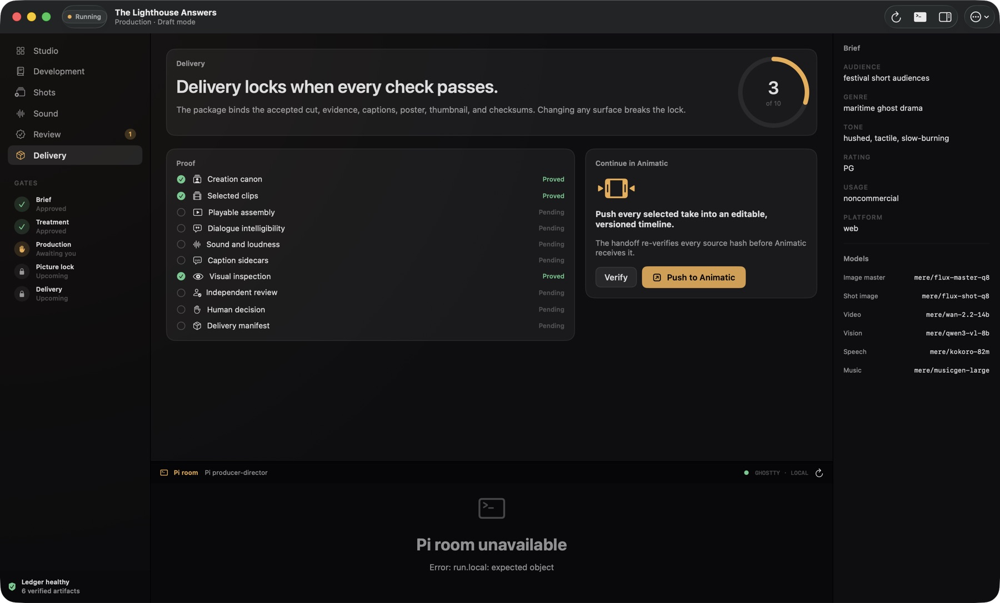

<p align="center">
  
</p>

<h1 align="center">GRACE</h1>

<p align="center"><b>GR</b>oup of <b>A</b>gents for <b>C</b>reating <b>E</b>ntertainment</p>

<p align="center"><em>An idea walks in. A film walks out.</em></p>

<p align="center">
  <a href="https://grace.mere.run">Website</a> ·
  <a href="#it-stops-and-asks-you-five-times">How it works</a> ·
  <a href="#build-it">Build it</a> ·
  <a href="#everything-runs-on-your-mac">Local by design</a>
</p>

<p align="center">
  
</p>

GRACE is a multi-agent film studio that runs entirely on your Mac. You give it one sentence. A lead producer agent, running on Pi, builds a crew of specialist agents that write, plan, shoot, voice, and score a short film using local `mere.run` models. The production stops at five points and waits for your sign-off. Nothing ships without you.

The app in this repo is **Mere Film Studio** — GRACE's control room: a native SwiftUI macOS app with an embedded Ghostty terminal for talking to Pi mid-production.

## It stops and asks you five times

The agents work on their own between gates, but each of these needs your explicit approval before the production continues:

| | Gate | You approve |
|---|---|---|
| 1 | **Brief** | What you're making — after Pi asks the few questions that matter |
| 2 | **Treatment** | The story: logline, synopsis, beats, and how the film should look and sound |
| 3 | **Production** | The plan: cast, locations, a shot-by-shot list, and how many takes to render |
| 4 | **Picture lock** | The cut itself, after the checks run and the critics weigh in |
| 5 | **Delivery** | The finished film with captions, poster, and a receipt for every file |

Each approval is recorded against the exact files you saw, so the finished film can't change quietly afterward. GRACE cannot approve its own film.

## The crew

Every department is an agent with a job, a status, and a paper trail.

| Agent | Job |
|---|---|
| **Story writer** | Turns the brief into a treatment, beats, and a screenplay worth shooting |
| **Cinematographer** | Blocks the film shot by shot — purpose, framing, motion, transitions |
| **Casting director** | Creates the reference images for cast and locations so every frame stays consistent |
| **Sound designer** | Dialogue performances, authored effects, and score on one accepted timeline |
| **Continuity supervisor** | Checks every generated take against those references before it can be selected |
| **Independent critic** | Reviews the cut with fresh eyes and files targeted reroll requests |

## The control room

| | |
|---|---|
|  |  |
| **Shot board.** Keyframes, takes, and transitions — hover a shot to preview its clip, right-click to reroll. | **Development.** Treatment, story beats, and the cast and location references the whole crew works from. |
|  |  |
| **Review.** The checks gather the evidence. You watch the cut and make the final call. | **Delivery.** All ten checks passed: the finished film, its receipts, and a verified push to Animatic. |

## Ten checks before it ships

GRACE will not call a film finished until all ten pass:

- Characters and places stay consistent shot to shot
- Every shot has a chosen take
- The cut actually plays — a real mp4, not a plan for one
- You can understand the dialogue (verified with speech-to-text)
- Sound sits at the right level (−16 LUFS)
- Captions are included
- Every frame gets looked at by a local vision model
- A second opinion on the cut from independent critic agents
- You signed off on it, and that decision is recorded
- Shipped files match approved files, byte for byte (SHA-256)

## Everything runs on your Mac

No cloud render queue, no per-frame bill. Your footage never leaves the laptop, and the app never reads or stores provider secrets.

| Role | Runs on |
|---|---|
| Direction and crew | Pi on a local agent model |
| Reference images and keyframes | Local image models |
| Shot video | Local video models |
| Visual inspection | Local vision models |
| Voices and dialogue verification | Local TTS + speech-to-text |
| Score and effects | Local music + SFX models |
| Model serving | `mere.run` |

## Build it

Requires an Apple Silicon Mac, macOS 15+, Xcode 26+, and XcodeGen. The app is `arm64`-only — GhosttyKit and the local model stack are not built for Intel.

```bash
git clone https://github.com/sawfwair/mere-film-studio
cd mere-film-studio
brew install xcodegen
./scripts/check.sh          # lint, tests, and a full app build
open MereFilmStudio.xcodeproj
```

For the native Ghostty terminal surface:

```bash
brew install anyzig
./scripts/bootstrap-ghostty.sh
./scripts/generate-project.sh
```

Ghostty is pinned and built locally; generated frameworks and upstream sources are never committed.

To package a drag-to-Applications disk image:

```bash
./scripts/package-app.sh    # artifacts land in .build/release/
```

The disk image is ad-hoc signed for local use. Public distribution still needs a Developer ID certificate and notarization.

### Runtime requirements

- `mere-film-tools` — owns gates, jobs, hashes, and durable production state
- `pi` — the agent runtime; MereRun-managed installs are discovered automatically
- a `mere.run` build with `agent status` and `agent start --inline` support
- `ffmpeg` and `ffprobe`
- `animatic` — only if you publish an editing handoff

The app runs outside the Mac App Store sandbox so it can start these local, user-installed tools. Before any Animatic handoff is written, the export is independently checked for project identity, contiguous timing, safe paths, exact byte counts, and SHA-256 digests.

## Repo layout

```
App/                      The SwiftUI control room
Sources/FilmStudioCore/   Typed clients and the production ledger
Sources/GhosttyBridge/    Embedded Ghostty terminal
site/                     grace.mere.run (SvelteKit + Cloudflare)
scripts/                  check, bootstrap, package
```

---

<p align="center">
  Built in 24 hours for the <em>Build an AI Agent</em> hackathon.<br>
  <code>mere.run</code> · <code>pi</code> · <code>qwen3.8</code> · <code>swiftui</code> · <code>ghostty</code> · <code>animatic</code>
</p>
